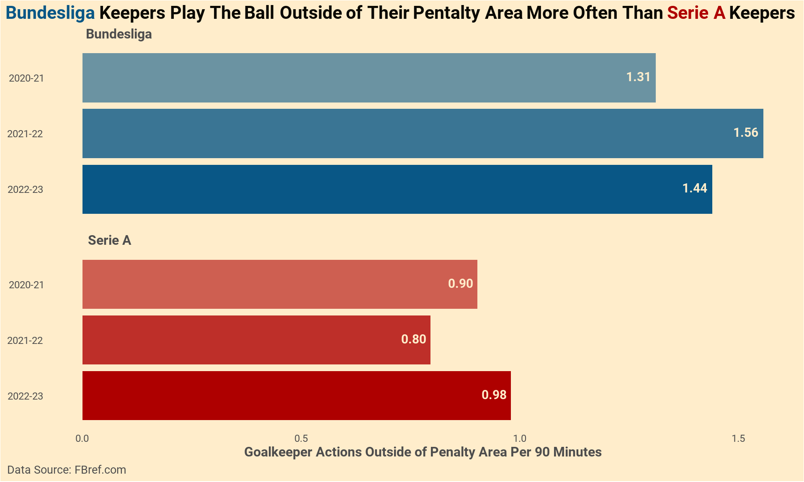
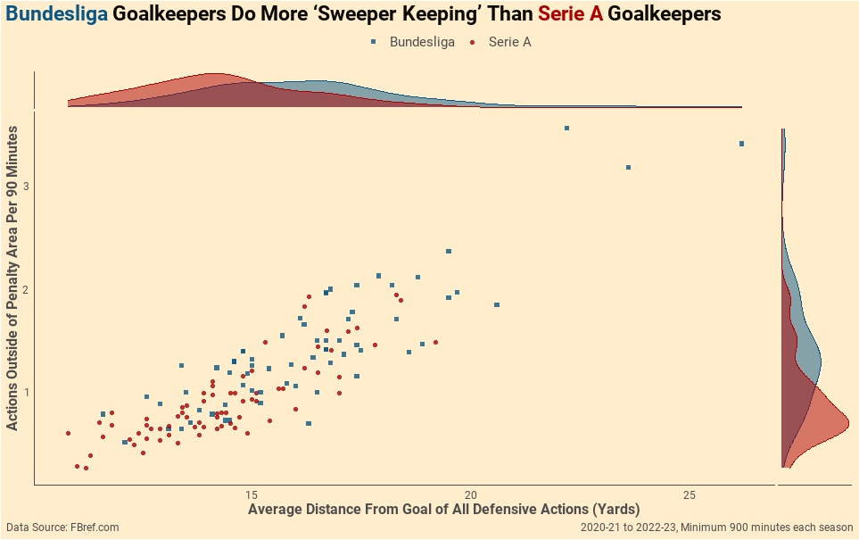

```{r Settings, echo=FALSE}
#No messages and warnings in HTML output
knitr::opts_chunk$set(warning = FALSE, message = FALSE, echo = FALSE,
                      fig.width = 10, fig.height = 6)
```


When I began exploring the advanced goalkeeping statistics available on FBref.com, I noticed an interesting pattern - goalkeepers in the Bundesliga seemed to play the ball outside of their box very frequently, while goalkeepers in the Serie A seemed to play the ball outside of their box relatively infrequently. The average number of actions that keepers in each of these leagues made outside of their respective pentalty areas in each of the last three seasons is illustrated in the plot below.  

``` {r ETL Steps}
##### Setup ##### 

#Clear memory
rm(list = ls(all = TRUE))

#Load packages
if (!require("pacman")) install.packages("pacman")
pacman::p_load(
  tidyverse,     # data management and visualization
  ggtext,        # Fancy Annotations using HTML etc
  ggside,        # Density plots in margins of ggplots
  ggrepel,       # repulsive text annotations
  showtext,      # help with downloaded fonts  
  systemfonts,   # use downloaded fonts
  colorspace,    # lighten and darken colors etc
  worldfootballR # football statistics
)

#Download advanced GK stats from FbRef for 2020-21 to 2022-23 seasons
myData <- fb_big5_advanced_season_stats(season_end_year= c(2021:2023), stat_type= "keepers_adv", team_or_player= "player")

#Download basic GK stats from FbRef for 2020-21 to 2022-23 seasons
kprs_bas <- fb_big5_advanced_season_stats(season_end_year= c(2021:2023), stat_type= "keepers", team_or_player= "player") %>%
  select(Player, Season_End_Year, Min_Playing) #I only acutally need minutes played from this

#Join the two datasets
myData <- full_join(myData, kprs_bas, by=c("Player","Season_End_Year"))

#Add Roboto font family
font_add(family = "Roboto", 
         regular = "C:/USERS/GVAND/APPDATA/LOCAL/MICROSOFT/WINDOWS/FONTS/ROBOTO-REGULAR.ttf",
         bold = "C:/USERS/GVAND/APPDATA/LOCAL/MICROSOFT/WINDOWS/FONTS/ROBOTO-BOLD.ttf")
showtext_auto()

#Palette for plotting
myPal <- c(
  myBlue = '#095786',
  myRed ="#ae0000", 
  myBeige = lighten("#e6cea0", 0.65),
  dark_text = "#0a0903",
  light_text = "grey30" 
)

#Tiny bit of cleaning
myData <- myData %>%
  rename(OPA = "#OPA_Sweeper",
         OPA_90 = "#OPA_per_90_Sweeper",
         AvgDist = "AvgDist_Sweeper") %>%
  mutate(Year = case_when(
    Season_End_Year == 2021 ~ "2020-21",
    Season_End_Year == 2022 ~ "2021-22",
    Season_End_Year == 2023 ~ "2022-23"
    ), 
    Year = factor(Year, levels = c("2022-23","2021-22","2020-21")) # for ordering in plot
  ) 
```

``` {r Bar Plot}
##### Bar Plot #####

#Aggregate Data
barPlotData <- myData %>%
  filter(Comp %in% c("Serie A", "Bundesliga")) %>%
  group_by(Comp, Year) %>%
  summarise(OPA_90 = (sum(OPA, na.rm = TRUE)/sum(Min_Playing, na.rm = TRUE))*90) %>%
  ungroup()
#Plot
barPlotData %>%
  ggplot(aes(x = Year, y = OPA_90, fill=Comp)) +
  geom_bar(stat = "identity", position = "dodge", colour = myPal["myBeige"], aes(alpha=Year)) + 
  coord_flip() + 
  scale_alpha_manual(values = c(1,0.8,0.6)) + 
  scale_fill_manual(values = c("#095786","#ae0000"))+  #scale fill argument glitching when feeding palette values
  scale_color_manual(values = c("#095786","#ae0000"))+
  facet_wrap(Comp ~ ., ncol = 1) +
  labs(y = "Goalkeeper Actions Outside of Penalty Area Per 90 Minutes",
       title = paste0("<span style='color:",
                      myPal["myBlue"], "'>Bundesliga</span>
                      Keepers Play The Ball Outside of Their Pentalty Area
                      More Often Than <span style='color:",
                      myPal["myRed"], "'>Serie A</span> Keepers"),
       caption = "Data Source: FBref.com") +
  geom_richtext(aes(label= format(round(OPA_90,2), nsmall=2)), #format w/ nsmall keeps trailing zeros
            hjust=1,
            color=myPal["myBeige"],
            fill=NA,
            label.colour=NA,
            family="Roboto",
            fontface = "bold",
            size = 8,
            )+
  theme(legend.position = "none",
        plot.title.position = "plot",
        axis.title.y = element_blank(),
        axis.title.x = element_text(face = "bold",
                                    color = myPal["light_text"],
                                    size = 24,
                                    margin = margin(6,0,6,0)),
        axis.ticks = element_blank(),
        axis.text = element_text(color=myPal["light_text"], size=18),
        text = element_text(family = "Roboto", colour = myPal[3]),
        plot.caption = element_text(family = "Roboto", colour = myPal["light_text"], 
                                    hjust = -0.065, size = 20),
        plot.title = ggtext::element_textbox_simple(family = "Roboto",
                                                    size = 32,
                                                    face = "bold",
                                                    halign = 0, colour = myPal["dark_text"],
                                                    margin = margin(4,0,10,0)),
        strip.text = element_text(family = "Roboto",
                                  hjust = 0.05,
                                  face = "bold",
                                  size = 24,
                                  colour = myPal["light_text"]),
        plot.background = element_rect(fill  = myPal["myBeige"]),
        panel.grid = element_blank(),
        panel.background = element_blank(),
        strip.background = element_blank())
```

In the next plot, individual data points represent goalkeeper-year combinations. Although there are a few outliers in the Bundesliga, the plot shows quite clearly that these few points are not the only ones driving the difference. Goalkeepers in the Bundesliga in general play the ball further up the pitch and more frequently outside of their penalty areas than goalkeepers in the Serie A. This is almost surely the result of a combination of factors and the degree to which the cross-league differences are attributable to the keepers themselves is unclear. Nevertheless, the pattern is an interesting one.    

``` {r Scatter Plot}

#### Scatter Plot ####
# Wrangle Data
sctrPlotData <- myData %>%
  filter(Comp %in% c("Serie A", "Bundesliga"),
         Min_Playing >= 900) %>%
  select(Player, Year, Comp, OPA_90, AvgDist, Min_Playing)
# Plot
sctrPlotData %>%
  ggplot(aes(x = AvgDist, y = OPA_90, color=Comp,fill = Comp, shape=Comp)) +
  geom_point(alpha = 0.8) + 
  geom_text_repel(aes(label =
                        case_when(OPA_90 > 3 ~ paste0(strsplit(Player,"\\s+") %>% sapply(`[`, 2),
                                                      ", " ,
                                                      Year),
                                  TRUE ~ ""),
                      ),
      show.legend = FALSE, size = 6, family = "Roboto", alpha = 0.8) +
  geom_xsidedensity(aes(y=after_stat(density)), alpha = 0.5, show.legend = FALSE) +
  geom_ysidedensity(aes(x=after_stat(density)), alpha = 0.5, show.legend = FALSE) + 
  scale_xsidey_continuous(breaks = NULL) +
  scale_ysidex_continuous(breaks = NULL) +
  scale_color_manual(values = c("#095786","#ae0000"),
                     name= "") +
  scale_fill_manual(values = c("#095786","#ae0000"),
                     name= "") +
  scale_shape_manual(values=c(15,16),
                     name="") +
  labs(y = "Actions Outside of Penalty Area Per 90 Minutes",
       x = "Average Distance From Goal of All Defensive Actions (Yards)",
       title = paste0("<span style='color:",
                      myPal["myBlue"], "'>Bundesliga</span>
                      Keepers Do More 'Sweeper Keeping'
                      Than <span style='color:",
                      myPal["myRed"], "'>Serie A</span> Keepers"),
       subtitle = "\n",
       caption = c("Data Source: FBref.com", #Bottom-left caption
                   "2020-21 to 2022-23, Minimum 900 minutes each season" )) + #Bottom-right caption
  guides(fill = "none") + #exclude fill aestethic from legend
  theme(
        # legend.position = "top",
        legend.position = c(0.055,1.065),
        legend.direction = "horizontal",
        legend.margin = margin(5,0,5,0),
        legend.background = element_rect(fill =myPal["myBeige"]),
        legend.key = element_blank(), #remove grey behind each point
        legend.text = element_text(color = myPal["light_text"], size = 22),
        plot.title.position = "plot",
        axis.title.y = element_text(face = "bold",
                                    color = myPal["light_text"],
                                    size = 24,
                                    margin = margin(0,6,0,0)),
        axis.title.x = element_text(face = "bold",
                                    color = myPal["light_text"],
                                    size = 24,
                                    margin = margin(6,0,6,0)),
        # axis.ticks = element_line(color=myPal["light_text"]),
        axis.ticks = element_blank(),
        axis.text = element_text(color=myPal["light_text"], size=18),
        axis.line = element_line(color=myPal["light_text"]),
        # axis.line = element_blank(),
        text = element_text(family = "Roboto", colour = myPal[3]),
        plot.caption = element_text(family = "Roboto", colour = myPal["light_text"], 
                                    hjust = c(-0.04,1), size = c(20,20)), #Allows captions in bottom right and bottom left
        plot.title = ggtext::element_textbox_simple(family = "Roboto",
                                                    size = 32,
                                                    face = "bold",
                                                    halign = 0, colour = myPal["dark_text"],
                                                    margin = margin(4,0,10,0)),
        plot.background = element_rect(fill  = myPal["myBeige"]),
        panel.grid = element_blank(),
        panel.background = element_blank())
  

```
<!-- <center> -->

<!--  -->

<!-- </center> -->

<!-- <center> -->

<!--  -->

<!-- </center> -->