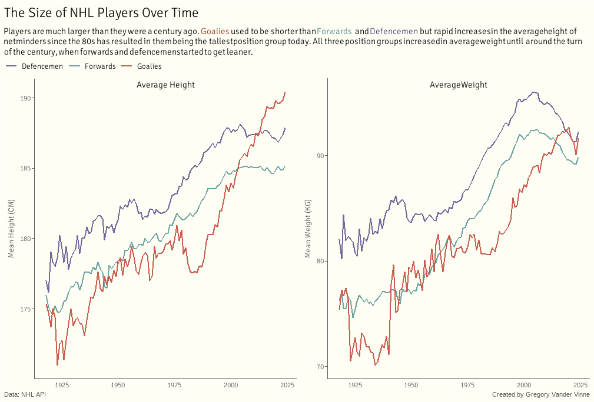

Below are a collection of data visualizations that I made as part of the Tidy Tuesday project. You can learn more about the Tidy Tuesday project [here](https://github.com/rfordatascience/tidytuesday). Code for my plots can be found in [this GitHub repo](https://github.com/GregoryVdvinne/Tidy_Tuesday). 

### 2024-01-09

I am aware of the unusual spacing between some words in the subtitle of this plot. If any R folks know what is causing this issue, I would appreciate the insight. 

